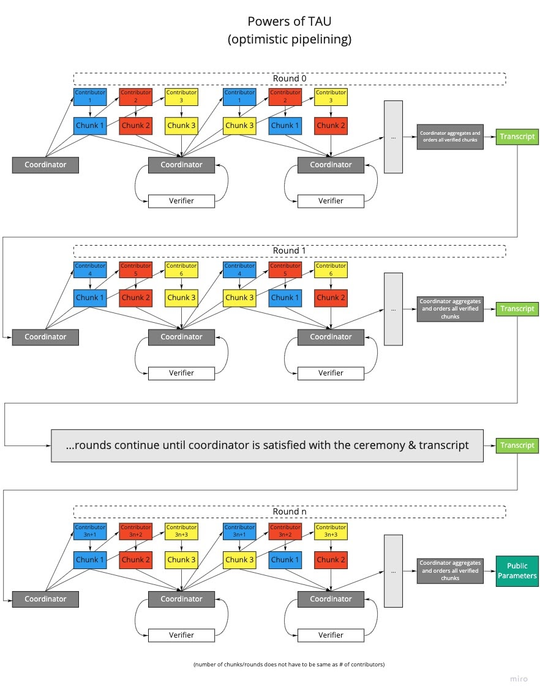

# Aleo Setup Coordinator Requirements

Vaguely following the format outlined here: <https://www.lucidchart.com/blog/software-requirements-documentation>.

This document contains documentation of the required functionality for the [`phase1-coordinator`](../) module.

Related overall setup requirements document here [Aleo Setup PRD][Aleo Setup PRD]

## Definitions

Definitions of various terms which are relevant to the purpose and implementation of the coordinator.

### Setup

A **Setup** is currently necessary pre-requisite task for a Zero Knowledge cryptography system. The aim of a setup is to generate a set of [parameters](#Parameters) using random numbers which will be used as a basis for proofs **TODO is this correct?**. In order for the system to be trustworthy, the source of randomness needs to be discarded. The ceremony is in effect, a public stage-show where members of the public are invited to participate as [contributor](#Contributor)s. The advantage of involving multiple contributors from the public is that in order for the system to be trustworthy, only one contributor needs to be honest with disposing of their source of randomness used to generate parameters.

Extra useful references:

+ [Zcash Parameter Generation](https://z.cash/technology/paramgen/)
+ [Setup Ceremonies ZKProof][Setup Ceremonies ZKProof]

### Parameters

TODO: specifically what are the parameters?

### Participant

A participant is an actor who performs a role during the ceremony, the coordinator provides them with tasks to perform. There are currently two type of participants: [contributor](#Contributor)s and [verifiers](#Verifier)s.

### Contributor

TODO: description

### Verifier

TODO: description

### Optimistic Pipelining

The marketing logic is that by making it easy for more people to contribute, it will increase the public's perceived trustworthiness of the system in question. **Optimistic Pipelining** is a new technique implemented for this project to allow [contributor](#Contributor)s to make contributions in parallel for a given round.

With optimistic pipelining:

+ For a given [round](#Round) the [parameters](#Parameters) are divided into chunks. **TODO**: is this the correct terminology?.
+ A [chunk](#Chunk) will be contributed to once by every contributor in the round, each [contribution](#Contribution) is based on the previous.
+ After a contribution has been made to a chunk, it needs to be verified before another contributor can make the next contribution.
+ A chunk can only have one contributor at a given time.

See [Setup Ceremonies ZKProof][Setup Ceremonies ZKProof] for a more detailed explanation and background for this technique.

### Round

A round of the [setup ceremony](#Setup). Each round ideally consists of a new set of [contributor](#Contributor)s.

### Chunk

TODO

### Contribution

As part of the design for [Optimistic Pipelining](#Optimistic-Pipelining), at the end of a round, each [chunk](#Chunk) will contain one contribution for each [contributor](#Contributor) participating in the round.

## Purpose

The purpose of this module is to provide logic to coordinate a

<!-- References -->
[Aleo Setup PRD]: https://docs.google.com/document/d/1Vyg2J60zRU6023KXBjZx8CP3V-Nz6hPOUCMplbCxVB4/
[Setup Ceremonies ZKProof]: https://docs.google.com/document/d/189hwHm5UFxT2jOFeCzL_YUvRfXEpTyQ1dsWEtuimR94/
